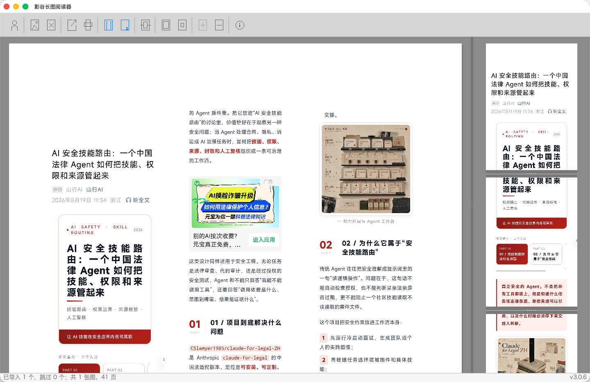

# LoimReader

[简体中文](README.md) | **English**


A cross-platform long-image reader and pagination studio: it organizes scattered screenshots, scanned pages and comic strips into one continuous long document, finds the best page breaks automatically, and previews every page exactly as it will print.

**Windows · macOS · Linux** ｜ **Intel / AMD64 · Apple Silicon / ARM64**



## What is it for?

Hundreds of chat screenshots to read in order and print as a booklet? A scanned book whose page breaks must not cut a line of text in half? A webtoon strip that takes forever to load in a browser?

LoimReader turns those images into a **virtual long document** — it never stitches them into one giant bitmap, but renders each slice on demand, so hundreds of high-resolution images won't blow up your memory. Then it solves the one question that matters: **where to cut**. Automatic pagination prefers image boundaries and large blank areas, so a line of text or a face is never sliced in half; if a break still lands wrong, drag the page-break line to fix it by hand.

Typical use cases:

- 📱 Reading and archiving chat histories and scrolling web screenshots
- 📖 Proofing scanned books and documents before printing
- 🎨 Smooth offline reading of webtoons and long illustrations
- 📄 Laying out a set of images into clean A4 pages (columns, page numbers, margins)

## Features

### Import & organize

- **Batch import**: open or drop multiple PNG / JPEG / GIF / BMP files at once; one broken file never blocks the rest
- **Virtual long document**: no giant stitched bitmap — slices are rendered on demand, so memory stays flat as you add images
- **Drop & read**: drag files into the window and start reading; append more anytime

### Smart pagination

- **Automatic page breaks**: prefers image boundaries and blank areas, so text lines are never cut mid-glyph
- **Manual break lines**: drag a page-break line in the preview to override a cut; manual and automatic results compose
- **One-click re-layout**: after changing the layout, hit Auto Split to recompute the optimal breaks

### Layout & preview

- **One / two / three columns**: cycle through column layouts with a single button
- **Page numbers**: bottom-right, bottom-center, or hidden
- **Margins**: step the print margins up and down
- **Dual canvas**: continuous long image on the left, page-by-page preview on the right, with a draggable divider
- **Preview zoom**: `+` / `-` to zoom the preview pages

### Thoughtful details

- **Remembers everything**: reopen the app and your layout, page numbers, margins, zoom — even the window position — are restored
- **Bilingual UI**: the interface follows your system language (English / 中文)
- **Truly cross-platform**: Windows, macOS (Intel / Apple Silicon), Linux (X11 / Wayland)

## Download

Grab the installer for your platform from **[ctdy123.com](https://ctdy123.com)**.

## Build from source

Requires CMake ≥ 3.25 and a C17 compiler; dependencies (SDL3 & friends) are fetched by CMake:

```bash
cmake -S . -B build -DBUILD_TESTING=ON
cmake --build build --parallel
ctest --test-dir build --output-on-failure
```

## Pro

Need to **export the layout as PDF**, **print directly**, or sign in to unlock the full feature set?
**[Get LoimReader Pro at ctdy123.com →](https://ctdy123.com)**

## Documentation

- [System design](docs/architecture/SYSTEM_DESIGN.md)
- [Dependency & license policy](docs/architecture/DEPENDENCY_POLICY.md)
- [Architecture decision records](docs/adr/)

Third-party component licenses: [THIRD_PARTY_NOTICES](THIRD_PARTY_NOTICES.md).
